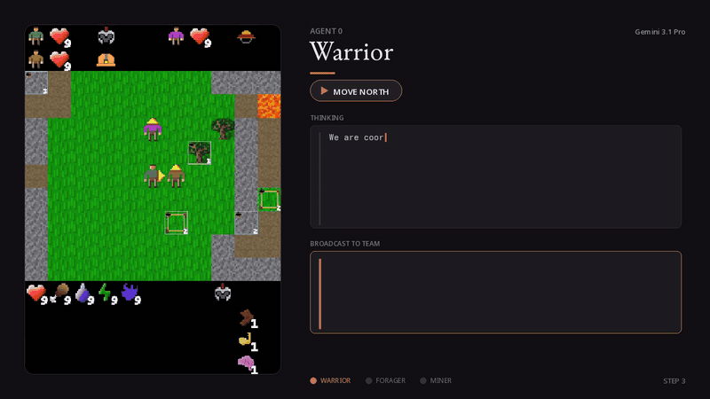

# Alem 实验仓库

基于 [alem-world/alem-env](https://github.com/alem-world/alem-env) 的个人 fork，用于随机策略、MARL 和 LLM 多智能体实验。环境规则沿用上游，Python 接口仍为 `import alem`。

## 目录

| 目录 | 内容 |
| --- | --- |
| `algorithms/random/` | 合法动作掩码随机策略 |
| `algorithms/rl/` | IPPO、HyperMARL、MAPPO、PQN-VDN 与训练工具 |
| `algorithms/llm/` | LLM 评估、智能体、提示词构建与相关测试 |
| `envs/alem/` | 环境逻辑、地图生成、渲染、贴图及环境测试 |
| `configs/rl/`、`configs/llm/` | Hydra 算法与评估配置 |
| `configs/dependencies/` | CPU/GPU 依赖清单与 demo 依赖锁定文件 |
| `scripts/` | 随机 demo、人类试玩、LLM smoke/eval、结果提交入口 |
| `docs/` | 评估协议、上游说明、demo 文档 |
| `docs/media/` | 保留的 LLM 演示动画 |
| `docker/` | 容器构建与入口 |
| `outputs/` | 本地运行结果，不提交到 Git |

## 最轻量 demo

在仓库根目录执行，Python 3.12，仅 CPU：

```bash
uv venv --python 3.12 .venv
uv pip install --python .venv/bin/python -r configs/dependencies/requirements-demo.lock
uv pip install --python .venv/bin/python --no-deps -e .
.venv/bin/python -u scripts/random_visual_demo.py --steps 100 --seed 0 --coord easy
```

打开 `outputs/random_demo/replay.gif` 查看三个智能体的回放。统计和动作记录分别写入 `summary.json`、`trace.jsonl`。首次运行需要生成贴图缓存和编译 JAX。

仅终端统计：

```bash
JAX_PLATFORMS=cpu .venv/bin/python scripts/random_rl_agent.py --steps 100 --coord easy
```

[随机 demo 说明](docs/RANDOM_DEMO.md) · [RL 算法说明](algorithms/rl/README.md) · [LLM 使用说明](algorithms/llm/README.md)

## LLM 演示

无需运行模型即可查看官方演示：



[智能体通信演示](docs/media/llm_communication.gif)

真正运行 LLM 时再安装可选依赖，服务模型与环境建议分开安装：

```bash
uv pip install --python .venv/bin/python -e '.[baselines-llm]'
scripts/smoke_llm.sh MODEL_ID --base-url http://localhost:8000/v1 --steps 5 --coord easy
```

## 验证与上游

```bash
JAX_PLATFORMS=cpu .venv/bin/python -m unittest alem.tests.test_env_factory -v
```

`origin` 指向个人 fork，`upstream` 指向官方仓库。本次整理基于上游提交 `14d412e5ee961f9c43d6ce92ee05fee9cd1efc5e`。移动目录时同步更新了安装配置、Hydra 路径、脚本、Docker 与 CI；环境机制未修改。

[官方完整说明](docs/UPSTREAM_README.md) · [评估协议](docs/EVALUATION.md) · [贡献说明](docs/CONTRIBUTING.md) · [MIT License](LICENSE)
